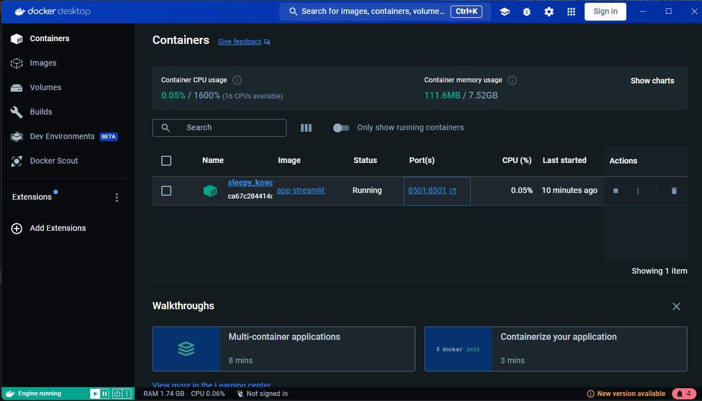
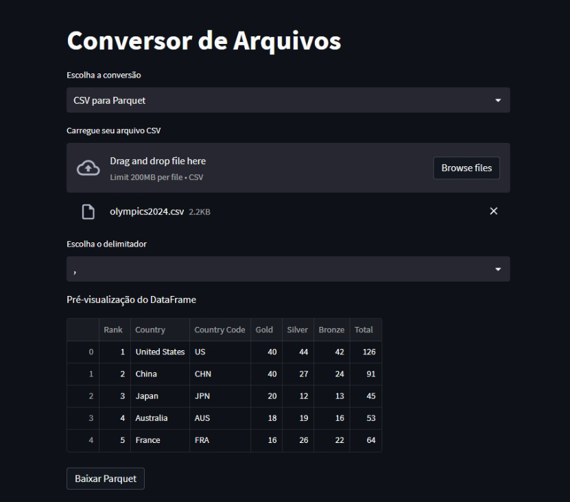

# Projeto Conversor de Arquivos Parquet e CSV

Este projeto é uma aplicação em Python que permite a conversão entre arquivos nos formatos Parquet e CSV, desenvolvida usando as bibliotecas **Pandas** e **Streamlit**. A aplicação fornece uma interface intuitiva para carregar, visualizar e converter arquivos, facilitando o trabalho com grandes volumes de dados.

## Funcionalidades

- **Conversão de Parquet para CSV**: Carregue um arquivo Parquet, visualize as primeiras linhas do DataFrame e converta para o formato CSV.
- **Conversão de CSV para Parquet**: Carregue um arquivo CSV com o delimitador escolhido, visualize as primeiras linhas do DataFrame e converta para o formato Parquet.

## Tecnologias Utilizadas

- **Python**
- **Pandas**: Para manipulação de dados.
- **Streamlit**: Para criação da interface web interativa.
- **Docker**: Para criar, enviar e executar a aplicação em contêineres, garantindo consistência em diferentes ambientes.

### Como o Docker é usado neste projeto

Neste projeto, Docker é usado para containerizar a aplicação, garantindo que ela funcione de maneira uniforme em diferentes ambientes. O Dockerfile define o ambiente de execução da aplicação e inclui:

- **Sistema Operacional Base**: A imagem base utilizada é o Python 3.9-slim.
- **Dependências**: As dependências do projeto são instaladas automaticamente durante a construção da imagem Docker.
- **Código do Projeto**: O código da aplicação é copiado para o contêiner e preparado para execução.




### Comandos Docker Utilizados

- **Construir a Imagem**: 

    ```bash
    docker build -t app-streamlit .
    ```

    Esse comando cria uma imagem Docker a partir do Dockerfile, nomeando a imagem como `app-streamlit`.

- **Executar o Contêiner**:

    ```bash
    docker run -p 8501:8501 app-streamlit
    ```

    Esse comando inicia um contêiner a partir da imagem `app-streamlit` e mapeia a porta 8501 do contêiner para a porta 8501 da sua máquina local.

Docker é fundamental para garantir que o ambiente da aplicação seja consistente e para facilitar a distribuição e execução do projeto.

## Como Executar

1. Clone este repositório:
   ```bash
   git clone https://github.com/JohnatanChavess/projetoConversor.git

2. Navegue até o diretório do projeto:

cd projetoConversor

3. Crie e ative um ambiente virtual

python -m venv .venv

Para Linux/MacOS:

source .venv/bin/activate

Para Windows:

.venv\Scripts\activate


4. Instale as dependências do projeto:

pip install -r requirements.txt


5. Execute a aplicação:

streamlit run app.py





6. Abra o navegador e acesse http://184.72.11.53:8501 para usar a aplicação.
